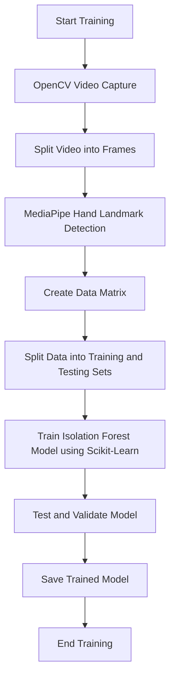
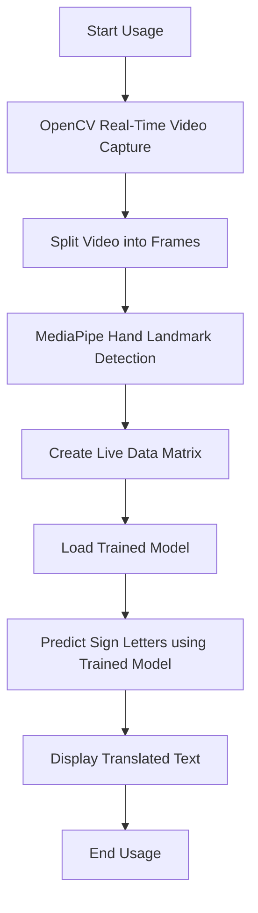

## Abstract

Aridia ML is a machine learning model designed to facilitate the understanding and translation of sign languages, starting with American Sign Language (ASL) and aiming to include Nicaraguan Sign Language (NSL) in both Nicaraguan Spanish & Nicaraguan Creole English, and Mexican Sign Language (MSL). This model captures real-time video and translates sign language into individual letters, enabling users to practice and learn sign language. Aridia ML leverages a server-client architecture to streamline tasks and ensure portability across various devices, including embedded systems and mobile platforms like iOS and Android. Utilizing OpenCV for video capture, MediaPipe for hand landmark detection, and Scikit-Learn for model training and prediction, Aridia ML presents an efficient and scalable solution for real-time sign language translation.

## How it Works

Aridia ML employs a multi-stage process involving video capture, data processing, and machine learning to translate sign language into text. The workflow is divided into three main phases:

1. **Video Capture and Data Preparation**: Using OpenCV, Aridia ML captures video footage and splits it into frames, creating a dataset of images representing different signs.
2. **Landmark Detection and Data Processing**: MediaPipe processes these frames to identify hand landmarks, which are then used to create a data matrix of features.
3. **Model Training and Prediction**: Scikit-Learn uses the data matrix to train an isolation forest model, which can predict the corresponding sign letters from new video frames.

## Training Flow

## Usage Flow

## Basics of MediaPipe and OpenCV for Data Analysis

### MediaPipe

MediaPipe is a cross-platform framework developed by Google for building multimodal, cross-platform machine learning pipelines. It provides a comprehensive solution for various computer vision tasks, including hand tracking and gesture recognition. In Aridia ML, MediaPipe is used to detect and track hand landmarks in video frames, extracting key points that represent the hand's position and orientation.

### OpenCV

OpenCV (Open Source Computer Vision Library) is an open-source computer vision and machine learning software library. OpenCV provides tools for real-time computer vision tasks such as image and video capture, processing, and analysis. In Aridia ML, OpenCV is used for capturing video, splitting it into frames, and performing preliminary image processing tasks.

## Identifying Signs by Using Isolation Forests and Data Matrix

### Data Matrix Creation

The first step in identifying signs is creating a data matrix from the captured video frames. Each frame is processed to extract hand landmarks using MediaPipe. These landmarks are then organized into a matrix where each row represents a frame and each column represents a landmark feature.

### Isolation Forests for Anomaly Detection

Isolation Forest is an unsupervised learning algorithm used for anomaly detection. In Aridia ML, Isolation Forests are employed to isolate the normal patterns in the landmark data, identifying the unique patterns associated with each sign. This helps in distinguishing between different signs and ensuring accurate prediction.

## Supercharging the Model Using Scikit-Learn

Scikit-Learn is a powerful machine learning library in Python that provides simple and efficient tools for data mining and data analysis. Aridia ML uses Scikit-Learn to train the isolation forest model and perform predictions. The steps involved are:

1. **Data Preparation**: Using NumPy, the landmark data matrix is split into training and testing datasets. Each row of the matrix corresponds to a specific sign letter.
2. **Model Training**: The training dataset is used to train the isolation forest model, learning the unique patterns of hand landmarks for each sign letter.
3. **Model Testing and Validation**: The testing dataset is used to validate the model's accuracy and ensure it can reliably predict the correct sign letters from new video frames.

## Obtaining Results by Comparing Pre-trained Data with Real-Time Data

### Real-Time Data Processing

In real-time use, OpenCV captures live video, which is then split into frames. MediaPipe processes these frames to extract hand landmarks, creating a live data matrix similar to the one used in training.

### Prediction and Translation

The trained isolation forest model uses the live data matrix to predict the sign letters. By comparing the real-time landmark data with the pre-trained patterns, the model can accurately translate the signs into text.

### Computational Image Landmarks as Matrix Data

The power of computational image landmarks lies in their ability to represent complex hand movements as numerical data. This transformation allows for efficient analysis and prediction using machine learning algorithms. By isolating the unique patterns in the landmark data, Aridia ML can accurately identify and translate sign language in real-time.

## Conclusion

Aridia ML provides a robust solution for real-time sign language translation, leveraging the capabilities of OpenCV, MediaPipe, and Scikit-Learn. Its server-client architecture ensures portability and scalability, making it suitable for various platforms. By combining video capture, landmark detection, and machine learning, Aridia ML offers an effective tool for learning and practicing sign language, with future expansions planned for additional sign languages.
